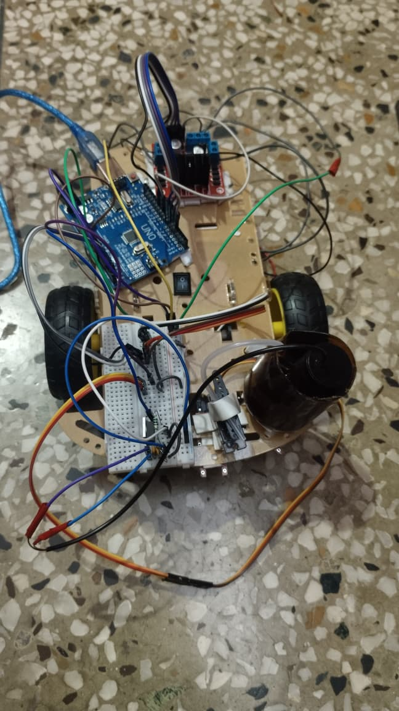
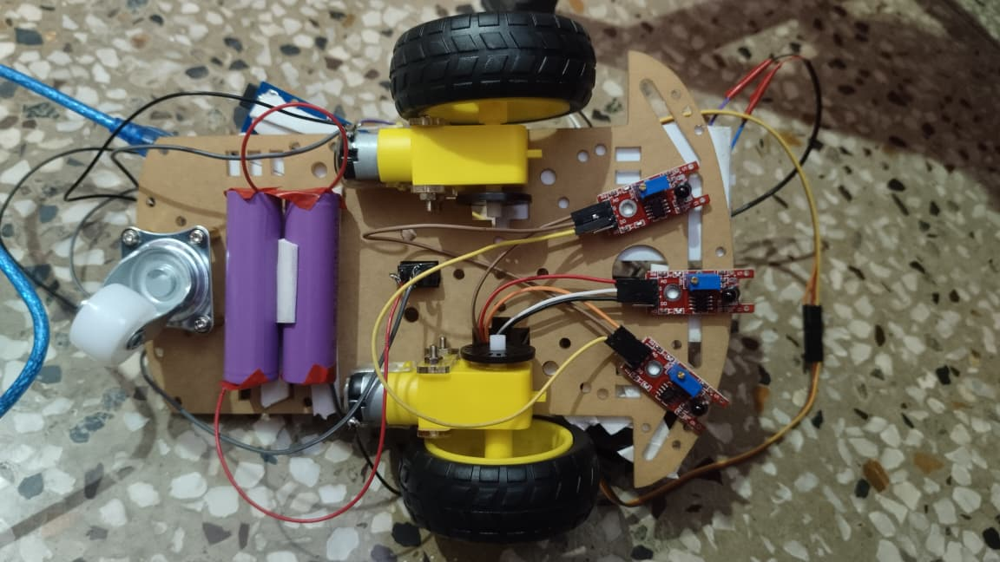

# Smart Fire Fighting Robot using Arduino

## Project Prototype

### Hardware Setup

### Sensor and Chassis View

---

## Overview
Smart Fire Fighting Robot is an autonomous robot designed to detect fire, move toward the flame source, and extinguish it automatically using a water pump controlled by Arduino.

---

## Hardware Components
- Arduino Uno  
- 3 Flame Sensors (Left, Center, Right)  
- L298N Motor Driver  
- DC Gear Motors  
- Servo Motor  
- Water Pump  
- Relay Module  
- Li-ion Battery Pack  
- Robot Chassis  

---

## Working Principle
1. Flame sensors detect fire direction.  
2. Arduino processes sensor inputs.  
3. Robot navigates toward the fire source.  
4. Servo aligns water nozzle.  
5. Water pump sprays water automatically.

---

## Features
- Autonomous Fire Detection  
- Automatic Fire Extinguishing  
- Multi-Sensor Navigation  
- Arduino Based Control  
- Low Cost Safety Robot  

---

## Circuit and Implementation
This project includes:
- Hardware Prototype  
- Circuit Connections  
- Arduino Programming  
- Fire Detection Algorithm  
- Extinguishing Mechanism  

---

## Applications
- Home Fire Safety  
- Industrial Fire Protection  
- Warehouses  
- Smart Buildings  
- IoT Safety Systems  

---

## Demo Video
Click image below to watch project demo:

Direct Video Link:  
https://drive.google.com/file/d/1BjNFz5paAG3evnkNEJQ1JabyyynPqG6l/view?usp=drive_link

---

## Project Documentation
Project report and documentation included in repository.

---

## Repository Contents
- Arduino Code  
- Project Report  
- Hardware Images  
- Circuit Diagram  
- Demo Video Link  

---

## Author
**Pratima Sahu**  
Bachelor of Technology (Electrical Engineering & Internet of Things)  
3rd Year Student  
Madhav Institute of Technology & Science (MITS), Gwalior, Madhya Pradesh, India
